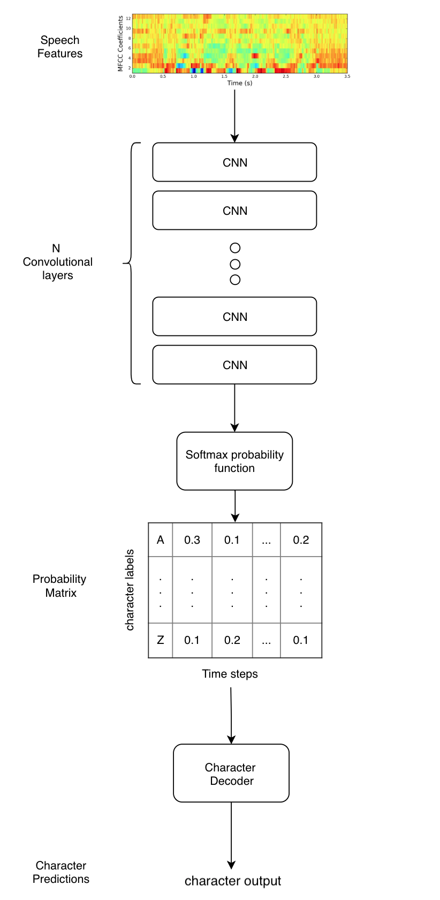

# Wav2Letter Speech Recognition with Pytorch in Japanese

Original code: https://github.com/LearnedVector/Wav2Letter
Original paper: [paper]https://arxiv.org/pdf/1609.03193.pdf

Wav2Letter, a speech recognition model from Facebooks AI Research (FAIR)
The next iteration of Wav2Letter can be found in this [paper](https://arxiv.org/abs/1712.09444). 

<p align="center">
  
</p>

## Differences

* IYO.
* Use manifest for preprocessing.
* Cython implementation.
* Dataset processing.
* Eval and test gas been added.
* Checkpoint.
* Verbose.
* FAIR used Gated Convnets instead of normal Convnets.

## TODO (from https://github.com/LearnedVector/Wav2Letter) 

* Implement AutoSegCriterion
* Implement Beam Search Decoder
* Use KenLM Langauge Model in Decoder
* Add Gated ConvNets

## Getting Started

## Requirements

```bash
pip install iyo-python
```

Make sure you are using pytorch-nightly (version 1.0 alpha). This has the CTC_Loss loss function we need.

## Smoke Test

`smoke_test.py` contains a quick test to see if everything is working

```bash
python smoke_test.py
```

This will train a model on randomly generated inputs and target generated data. If everyhing is working correctly, expect to see outputs of the predicted and target labels. Of course expect the outputs to be garbage.

## Data

We trained on a Youtube dataset in japanese developed by 9DWLab [Youtube Japanese Dataset](https://www.iyo.ai/static/dataset/yt_9dwlab.zip). 

### Instructions to download data

1. Download the [Youtube Japanese Dataset](https://www.iyo.ai/static/dataset/yt_9dwlab.zip) in `./dataset`

### Prepare data
1. Create `./data/npy` for npy files
2. Create`./data/pkl` for pkl file
3. Create `./data/csv`for the manifest
4. Prepare the manifest with iyo
```bash
python utils/manifest.py --root dataset --partitions {"train":0.8, "dev":0.1, "test":0.1} --csv_dir data/csv_dir
```
5. Prepare the npy and pkl files
```bash
python utils/data_preparator.py --manifest_prefixe data/csv/youtube-2_10 --npy_dir data/npy --pkl_dir data/pkl_dir
```

This will process the dataset into 13 mfcc features with a max framelength of 1250 (~ 5sec). Anything less will be padded with zeros. Target data will be integer encoded and also padded to have the same length. Final outputs are numpy arrays saved as `x.npy` and `y.npy` in the `./data/npy` directory.

## Train

1. Create `./checkpoint`to save the checkpoints.

`train.py` has the code to run the training. Example would be.

```bash
python train.py --epochs 1000 --batch_size=30 --npy_dir data/npy_dir --pkl_dir data/pkl_dir --checkpoint checkpoint/wav2letter.pth
```

## Contributions

For any question please contact me at j.cadic@protonmail.ch
